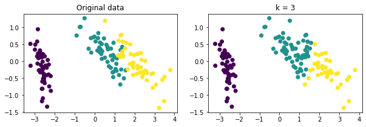

# Principal Component Analysis (PCA)

## Coursework in IN3050 


## Task 1: Implementation of PCA

The implementation of the PCA algorithm can be summarized into the following steps: 

1. Collect the data in a matrix $X \in \mathcal{R}^{N \times M}$, where every column represents an attribute. 
2. Centre the data by subtracting the mean of each column off X and call the new matrix $B$.
3. Compute the covariance matrix $ Cov(X) = 1/N \cdot P^TP$.
4. Compute the eigenvalues and eigenvectors of $Cov(X)$.
5. Sort the eienvalues in decreasing order, and apply the same order to the matrix of eigenvectors. 
6. Remove the last eienvectors according to how many ($m$) attributes you want to keep. 

Below is an implementation of the PCA algorithm that follows the instructions above.

```python
def pca(A,m):
    # INPUT:
    # A    [NxM] numpy data matrix (N samples, M features)
    # m    integer number denoting the number of 
    #      learned features (m <= M)
    #
    # OUTPUT:
    # pca_eigvec [Mxm] numpy matrix containing 
    #               the eigenvectors (M dimensions, m eigenvectors)
    # P          [Nxm] numpy PCA data matrix 
    #               (N samples, m features)
    
    B = center_data(A)
    C = compute_covariance_matrix(B)
    eigval, eigvec = compute_eigenvalue_eigenvectors(C)
    sorted_eigval, sorted_eigvec = sort_eigenvalue_eigenvectors(
                                    eigval, 
                                    eigvec
                                   )
    pca_eigval = sorted_eigval[:m]
    pca_eigvec = sorted_eigvec[:,:m]
    P = pca_eigvec.T @ B.T

    return pca_eigvec, P.T
```


Next we test the algorithm on some test data. We load a small synthetic dataset with two features from the module *syntheticdata*.
The data is visualized in the figure  below. 

    

    
A figure showing the data after centering is shown in the figure below.

    

    

### Visualize the first eigenvector

We want to visualize how the PCA algorithm works on the synthetic dataset. We use our PCA function to calculate the new data and the eigenvector that points in the direction of maximum variance.
    

    


    


## Evaluation: when are the results of PCA sensible?
So far we have used PCA on synthetic data. Let us now imagine we are using PCA as a pre-processing step before a classification task. This is a common setup with high-dimensional data. We explore when the use of PCA is sensible.

We load a similar set of data, with labels and perform the same steps as above. 

    

    


    


**Comment:** 
 - We can see that the dataset is almost separable and have a high variance, both are characteristics that are preserved after using PCA. In this case it seems that the use of PCA is reasonable. 


### Loading the second set of labels
We now load a third dataset with different labels and run the procedure as normal. 
This time we also plot the direction of the eigenvectors as well as their sum (which is also an eigenvector). 
The dataset is shown in figure \ref{fig: data3}, and the results after PCA is shown in figure \ref{fig: data3 PCA}.

    

    
    

    
**Comment:** 
 - We see that using the first eigenvector we get bad separation between the classes as they lie on top of each other in the direction of maxmimum variance. However the result is more separable when using the second eigenvector, which means that it might be more beneficial in this case to use the second eigenvectore instead. The second eigenvector is orthogonal to the first eigenvector (it looks skewed because of the plotting) so it will preserve more information from the data after PCA. Lastly we see that if we add the two vectors together we get a third vector that is also by definition an eigenvector, that can be used instead. It it represented in the figure above, and would possibly give even better separation in 1D. 

- To quantify how separable the two resulting 1D datasets are we use a linear percetron algorithm to see how well it is able to separate the data. When running it we get the following result:

```terminal
Score of perceptron using the first eigenvec  = 0.5
Score of perceptron using the second eigenvec = 0.84
```
 - We have considered both the first and second eigenvecors and also made an assumption about the sum of the two. We see in the figure above that the second eigenvector produces the best results. We have also used the perceptron algorithm to study how separable the two resulting 1D datasets are. The results show that using the first eigenvector we get a precision of 0.5 (equivalent to guessing) while the second eigenvector gives a precision of 0.84, which is significantly better. 

## Case study 1: PCA for visualization
We now consider the *iris* dataset, a simple collection of data (N=150) describing iris flowers with four (M=4) features. The features are: Sepal Length, Sepal Width, Petal Length and Petal Width. Each sample has a label, identifying each flower as one of 3 possible types of iris: Setosa, Versicolour, and Virginica.

Visualizing a 4-dimensional dataset is impossible; therefore we will use PCA to project our data in 2 dimensions and visualize it.
To do this we select two random features and show them in a figure before and after PCA.
The results are shown below.


    

    
    

    


**Comment:** 
 - We see that the dataset consists of almost linearly separable data, and that the PCA tends to precerve this . 


## Case study 2: PCA for compression
We now consider the *faces in the wild (lfw)* dataset, a collection of pictures (N=1280) of people. Each pixel in the image is a feature (M=2914).
We use PCA on the images to compless them by removing potentially unnecessary features and then reconstruct the image back into its original size. The results using different values of $m$ is shown in figure \ref{fig: faces}.


  

 
  


  

    


**Comment:**
 - We see that (not surprisingly) the images become more distorted and less recognizable for lower values of m. 
   This is because we effectively remove features from the faces using PCA and only keep the m most relevant features.
   The interesting part is that even though the faces appear weird and distorted for low values of m, they are still recognizable, which means that they should still be usable as a simplified dataset. 

##  PCA Tuning:
If we use PCA for compression or decompression, it may be not trivial to decide how many dimensions to keep. In this section we review a principled way to decide how many dimensions to keep.

The number of dimensions to keep is the only *hyper-parameter* of PCA. A method designed to decide how many dimensions/eigenvectors is the *proportion of variance*:
$$ \textrm{POV}=\frac{\sum_{i=1}^{m}{\lambda_{i}}}{\sum_{j=1}^{M}{\lambda_{j}}}, $$
where $\lambda$ are eigenvalues, $M$ is the dimensionality of the original data, and $m$ is the chosen lower dimensionality. 

Using the $POV$ formula we may select a number $M$ of dimensions/eigenvalues so that the proportion of variance is, for instance, equal to 95%.

We use the *proportion of variance* method to decide the value of $m$ to use in the PCA algorithm. We set the proportion of variance equal to 0.9 which we use to calculate $m$. The result is that $m=85$.
An example face before and after tuning is given below.
    


    


**Comment:** 
 - We see that the tuning sets m to 85 wich is a low value and leads to a pretty distorted face. This might mean that the algorithm thinks that is enough dimensions to keep while still keeping enough variance in the data. 

# K-Means Clustering:
In this section we use the *k-means clustering* algorithm to perform unsupervised clustering. We perform the algorithm on the iris data used before. The results are shown below.

    

    

    


**Comment:**
 - We see that the K-Means algorithm manages to separate clusters effectively and that for k=3 it resembles the original data quite accurately. However, it does not know how to label the clusters, so the actual accuracy is close to useless. 

# Quantitative Assessment of K-Means:

We are given the following tasks to perform:
- Train a Logistic regression model using the first two dimensions of the PCA of the iris data set as input, and the true classes as targets.
- Report the model fit/accuracy on the training set.
- For each value of K:
  - One-Hot-Encode the classes output by the K-means algorithm.
  - Train a Logistic regression model on the K-means classes as input vs the real classes as targets.
  - Calculate model fit/accuracy vs. value of K.
- Plot your results in a graph and comment on the K-means fit.


After training a logistic regression model using the first two dimension of the PCA of the iris data set as input we get the following result:

```
The accuracy score on the training set is: 0.967
```

Now we perform the K-Means algorithm for $k = 2, 3, 4, 5$ and report the accuracy after using a logistic regression model to accurately label the clusters. We get the following results:


```
    k = 2, acc = 0.667
    k = 3, acc = 0.887
    k = 4, acc = 0.840
    k = 5, acc = 0.900
```

Then we visualize how the original data compare to the different results using K-Means clustering for all values of k,
the results are shown in below.
    





    

Lastly we plot the accuracy as a function of $k$.
    

    


**Comment:** 
 - We see that using K-Means clustering is pretty effective for labeling the data. We get a good accuracy of 90% already for k=5 and would excpect that to be higher for larger values of k. We do, however, have to use logistic regression for labeling the data correctly and since the logistic regression classifier performed with an accuracy of 96% I wonder why we don't just use that alone instead. 
